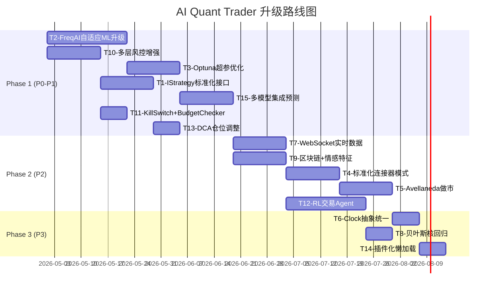

# 开源项目技术参考与应用方案

> **文档目标**：结合 AI Quant Trader 项目的六层事件驱动架构特点，从五个开源项目中提炼可参考和应用的技术、功能、方案，并详细分析原因和应用路径。

---

## 一、AI Quant Trader 项目现状概要

### 已实现的六层架构
| 层级 | 状态 | 核心组件 |
|------|------|----------|
| L1: 数据层 | ✅ 完成 | CCXT下载器 + Parquet存储 + DataFeed |
| L2: Alpha引擎 | ✅ 完成 | MACross(3x) + Momentum(3x) + ML Predictor v2(1x) |
| L3: 组合聚合 | ✅ 完成 | PortfolioAllocator(4种方法) + Rebalancer + Attributor |
| L4: 风控层 | ✅ 完成 | 5层硬约束 + 熔断机制 |
| L5: 执行层 | ✅ 完成 | CCXTGateway(Paper/Live) + OrderManager |
| L6: 监控层 | ✅ 完成 | Prometheus + Grafana + Audit Log |

### 已知的待优化项(PORTFOLIO_INTEGRATION_PLAN.md)
- P0: 预加载bars 50→500、收益率追踪、PerformanceAttributor集成
- P1: ContinuousLearner接入主循环、PortfolioRebalancer连接
- P2: 增量特征缓存(CPU -95%)、动态仓位(置信度加权)
- P3: 自适应阈值(Youden's J统计量)

### 当前技术缺口
1. 仅支持Spot交易，无做空能力
2. 单交易对策略，无跨标的套利
3. 无订单簿深度分析(仅OHLCV + Ticker)
4. 固定再平衡计划，无动态分配
5. 固定滑点假设(0.1%)
6. 无实时性能追踪仪表盘
7. 无外部报警系统
8. 审计追踪不完整

---

## 二、可参考技术方案全景

### 参考矩阵：开源项目 → AI Quant Trader 应用

| # | 参考技术 | 来源项目 | 应用层级 | 优先级 | 预期收益 |
|---|---------|---------|---------|--------|---------|
| T1 | IStrategy标准化策略接口 | freqtrade | L2 Alpha | P1 | 策略开发效率 ↑300% |
| T2 | FreqAI自适应ML框架 | freqtrade | L2 Alpha | P0 | ML预测能力质变提升 |
| T3 | Optuna超参优化系统 | freqtrade | L2 Alpha | P1 | 自动发现最优参数 |
| T4 | 标准化交易所连接器模式 | hummingbot | L5 执行 | P2 | 多交易所支持 |
| T5 | Avellaneda做市算法 | hummingbot | L2 Alpha(新) | P2 | 新增做市收益来源 |
| T6 | 事件驱动Clock抽象 | hummingbot | L1/Core | P2 | 回测/实盘统一 |
| T7 | 三层WebSocket架构 | openalgo | L1 数据 | P1 | 实时数据延迟 ↓90% |
| T8 | 贝叶斯核回归预测 | bitcoin-prediction | L2 Alpha | P3 | 增加模型多样性 |
| T9 | 区块链数据+情感特征 | BitVision | L2 Alpha | P2 | 特征维度升级 |
| T10 | 多层风控保护系统 | freqtrade | L4 风控 | P1 | 风控精细化 |
| T11 | Kill Switch + Budget Checker | hummingbot | L4 风控 | P1 | 实时风控增强 |
| T12 | 强化学习交易Agent | freqtrade(RL) | L2 Alpha(新) | P2 | AI进化交易 |
| T13 | DCA/仓位调整策略 | freqtrade | L3/L5 | P1 | 灵活加仓减仓 |
| T14 | 插件化懒加载系统 | openalgo | Core | P3 | 模块化可扩展性 |
| T15 | 多模型集成预测 | freqtrade+BitVision | L2 Alpha | P1 | 预测准确率 ↑ |

---

## 三、详细技术参考方案

### T1: IStrategy标准化策略接口 (来源: freqtrade)

#### 为什么参考
当前AI Quant Trader的策略(MACross/Momentum/MLPredictor)各自独立实现，缺乏统一接口规范。freqtrade的IStrategy模式提供了业界最成熟的策略标准化方案。

#### 当前状况 vs 参考方案

**当前**：每个策略独立实现generate_signal()方法，参数硬编码在yaml中
```python
# 当前模式：各策略自行定义接口
class MACrossStrategy:
    def generate_signal(self, kline_event) -> Optional[SignalEvent]: ...

class MomentumStrategy:
    def generate_signal(self, kline_event) -> Optional[SignalEvent]: ...
```

**参考方案**：统一策略接口 + 超参数空间 + 多周期数据
```python
class IStrategy(ABC):
    # 声明式参数空间(支持Optuna优化)
    fast_period = IntParameter(5, 50, default=10, space='entry')
    slow_period = IntParameter(20, 200, default=30, space='entry')
    
    @abstractmethod
    def populate_indicators(self, df: pd.DataFrame, metadata: dict) -> pd.DataFrame: ...
    
    @abstractmethod
    def populate_entry_trend(self, df: pd.DataFrame, metadata: dict) -> pd.DataFrame: ...
    
    @abstractmethod
    def populate_exit_trend(self, df: pd.DataFrame, metadata: dict) -> pd.DataFrame: ...
    
    # freqtrade特色：多周期数据装饰器
    @informative('4h')
    def populate_informative_4h(self, df, metadata): ...
```

#### 应用原因
1. **统一接口**：新策略只需实现3个方法，大幅降低开发成本
2. **参数空间声明**：与Optuna优化无缝对接
3. **多周期融合**：@informative装饰器自动合并高时间框架数据
4. **热加载**：配置变更不需重启(参考freqtrade的RELOAD_CONFIG状态)

#### 应用路径
1. 定义IStrategy基类(保留现有EventBus事件机制)
2. 将MACross/Momentum/MLPredictor重构为IStrategy子类
3. 添加Parameter类支持(IntParameter/FloatParameter/CategoricalParameter)
4. 实现策略动态加载(参考openalgo的plugin_loader)

---

### T2: FreqAI自适应ML框架 (来源: freqtrade) ⭐ 最高优先级

#### 为什么参考
AI Quant Trader已有ML Predictor v2(LightGBM)和ContinuousLearner，但FreqAI在以下方面远超当前实现：

| 能力 | AI Quant Trader当前 | FreqAI参考 |
|------|-------------------|-----------|
| 模型类型 | LightGBM/RF(2种) | 10+种(含PyTorch/RL) |
| 特征工程 | 60+手工特征 | DataKitchen自动化Pipeline |
| 漂移检测 | KS检验(单一) | DI散度指数 + 置信区间 |
| 数据预处理 | StandardScaler | MinMax + PCA + 去相关 |
| 持续学习 | 500bar定时 | 每K线增量更新 |
| 模型选择 | 手动切换 | 自动A/B测试 |
| 回测集成 | 独立Walk-Forward | 内嵌于策略回测 |

#### 关键参考点

**1. DataKitchen特征自动化**
```python
# FreqAI的DataKitchen模式
class DataKitchen:
    def prepare_features(self, raw_data):
        # 1. 自动计算200+技术指标
        # 2. PCA降维(保留95%方差)
        # 3. 特征去相关(datasieve)
        # 4. MinMax标准化
        # 5. 生成训练/验证/测试集
        return train_data, test_data, feature_names
```
→ AI Quant Trader的FeatureBuilder可升级为DataKitchen模式，增加自动PCA和去相关

**2. 散度指数(DI)检测**
```python
# FreqAI的DI阈值检测
if prediction_DI > self.freqai_config["DI_threshold"]:
    # 当前数据点远离训练分布，预测不可信
    prediction = 0  # 不交易
```
→ 比AI Quant Trader当前的KS检验更适合实时判断单个预测的可信度

**3. 相关标的特征注入**
```python
# FreqAI自动拉取相关标的数据作为特征
"include_corr_pairlist": ["ETH/USDT", "SOL/USDT"]
# 自动计算BTC与ETH、SOL的相关性特征
```
→ AI Quant Trader目前是单标的分析，引入相关标的可显著提升预测力

#### 应用原因
1. **模型多样性**：从2种到10+种，增强集成学习效果
2. **自动特征工程**：减少手工特征工程的劳动和错误
3. **DI散度指数**：实时判断单个预测是否可信(vs KS检验仅判断整体分布)
4. **跨标的特征**：加密市场高度相关，引入ETH/SOL等可显著提升BTC预测

#### 应用路径
1. 升级FeatureBuilder为DataKitchen模式(自动PCA+去相关)
2. 添加DI散度阈值到MLPredictor(每次预测附带可信度)
3. 扩展数据层支持多标的并行下载
4. 实现相关性特征自动注入

---

### T3: Optuna超参优化系统 (来源: freqtrade)

#### 为什么参考
AI Quant Trader当前参数(EMA周期、RSI阈值、ML阈值0.60/0.40等)均为手工设定。freqtrade的Optuna集成展示了如何自动化发现最优参数。

#### 关键参考点

**1. 参数空间定义**
```python
# freqtrade的HyperStrategyMixin
class MyStrategy(IStrategy):
    buy_rsi = IntParameter(10, 40, default=30, space='buy')
    sell_rsi = IntParameter(60, 90, default=70, space='sell')
    minimal_roi = {
        "0": DecimalParameter(0.01, 0.1, default=0.05, space='roi'),
        "40": DecimalParameter(0.001, 0.05, default=0.01, space='roi')
    }
```

**2. 多目标优化**
```python
# freqtrade支持的损失函数
loss_functions = [
    SharpeLoss,          # 最大化夏普率
    SortinoLoss,         # 最大化Sortino(下行风险调整)
    CalmarLoss,          # 最大化Calmar(收益/最大回撤)
    MaxDrawDownLoss,     # 最小化最大回撤
    ProfitDrawDownLoss,  # 平衡利润与回撤
]
```

**3. Walk-Forward优化**
- 滚动窗口回测 → 每窗口独立优化 → 样本外验证
- 防止参数过拟合到特定历史周期

#### 应用原因
1. **消除人工猜测**：MACross的EMA(10,30)是否最优？让Optuna自动搜索
2. **多目标平衡**：不仅追求利润，还要考虑回撤、夏普率
3. **防止过拟合**：Walk-Forward确保参数在未来数据上也有效
4. **自动化迭代**：定期重新优化，适应市场变化

#### 应用路径
1. 为每个策略定义Parameter空间(IntParameter/FloatParameter)
2. 集成Optuna库到BacktestEngine
3. 实现SharpeRatio/Sortino/MaxDrawdown损失函数
4. 构建Walk-Forward优化Pipeline
5. 定期自动优化 + 最优参数热部署

---

### T4: 标准化交易所连接器模式 (来源: hummingbot)

#### 为什么参考
AI Quant Trader当前通过CCXT直接调用交易所API(CCXTGateway)，但缺乏标准化的连接器抽象层。hummingbot的Connector Pattern是业界最佳实践。

#### 当前状况 vs 参考方案

**当前**：CCXTGateway直接包装ccxt
```python
class CCXTGateway:
    def place_order(self, symbol, side, quantity, price=None):
        return self.exchange.create_order(symbol, 'limit', side, quantity, price)
```

**参考方案**：标准化连接器接口
```python
class ExchangeConnector(ABC):
    @abstractmethod
    async def place_order(self, order_request: OrderRequest) -> OrderResponse: ...
    
    @abstractmethod
    async def cancel_order(self, order_id: str) -> bool: ...
    
    @abstractmethod
    async def get_balances(self) -> Dict[str, Balance]: ...
    
    @abstractmethod
    async def get_order_book(self, symbol: str, depth: int) -> OrderBook: ...
    
    @abstractmethod
    async def subscribe_trades(self, symbol: str, callback) -> str: ...
    
    # hummingbot特色：预算检查器
    def check_budget(self, order_request: OrderRequest) -> bool:
        available = self.get_balance(order_request.quote_asset)
        return available >= order_request.notional_value

class BinanceConnector(ExchangeConnector):
    """Binance-specific implementation"""
    ...

class OKXConnector(ExchangeConnector):
    """OKX-specific implementation"""
    ...
```

#### 应用原因
1. **多交易所扩展**：当前只用HTX，未来需要Binance/OKX/Bybit等
2. **统一接口**：策略层无需关心交易所差异
3. **内置验资**：Budget Checker防止余额不足的订单
4. **连接器热切换**：通过配置切换交易所，无需改代码

#### 应用路径
1. 定义ExchangeConnector ABC(基于hummingbot的ExchangeBase)
2. 重构CCXTGateway为HTXConnector
3. 添加BinanceConnector, OKXConnector等
4. 实现ConnectorFactory动态实例化
5. 添加BudgetChecker中间件

---

### T5: Avellaneda做市算法 (来源: hummingbot)

#### 为什么参考
AI Quant Trader当前仅支持趋势跟随(MACross/Momentum)和ML预测，缺少做市策略。做市是加密货币市场最稳定的盈利模式之一。

#### 算法核心
Avellaneda-Stoikov最优做市模型：
- **保留价格**: $r(s,q,t) = s - q \cdot \gamma \cdot \sigma^2 \cdot (T-t)$
  - $s$: 中间价, $q$: 库存, $\gamma$: 风险厌恶系数, $\sigma$: 波动率, $T$: 到期时间
- **最优价差**: $\delta^*(q,t) = \gamma \cdot \sigma^2 \cdot (T-t) + \frac{2}{\gamma} \cdot \ln(1 + \frac{\gamma}{\kappa})$
  - $\kappa$: 订单到达率参数

#### 应用原因
1. **新收益来源**：趋势策略在震荡市亏钱，做市策略在震荡市赚钱
2. **策略互补**：趋势跟随(牛/熊市) + 做市(震荡市) = 全天候收益
3. **理论基础强**：基于随机控制理论，有数学证明
4. **高频适配**：加密市场24/7运行，做市策略可持续赚取价差

#### 应用路径
1. 需先实现T4(连接器模式)以获取订单簿数据
2. 实现Avellaneda做市策略(继承IStrategy)
3. 添加库存管理模块(防止单边暴露)
4. 集成到L3组合层(与趋势策略协同分配)

---

### T6: 事件驱动Clock抽象 (来源: hummingbot)

#### 为什么参考
hummingbot的Clock抽象实现了回测和实盘的完全统一接口，这与AI Quant Trader的EventBus设计高度契合。

#### 关键设计
```python
class Clock:
    """统一时钟：实时模式用系统时间，回测模式用历史时间"""
    REALTIME = "realtime"   # 实时模式
    BACKTEST = "backtest"   # 回测模式
    
    def __init__(self, mode, tick_size=1.0):
        self.mode = mode
        self.tick_size = tick_size  # 控制CPU使用率
    
    def __iter__(self):
        if self.mode == self.BACKTEST:
            yield from self.historical_timestamps
        else:
            while True:
                yield time.time()
                time.sleep(self.tick_size)
```

#### 应用原因
1. **回测/实盘代码统一**：策略代码无需区分运行模式
2. **时间抽象**：EventBus可以被Clock驱动，而非直接依赖系统时间
3. **可控tick**：回测时可加速/减速

#### 应用路径
- 将现有BacktestEngine的时间管理抽取为Clock类
- EventBus的事件发布与Clock同步

---

### T7: 三层WebSocket架构 (来源: openalgo)

#### 为什么参考
AI Quant Trader当前数据层通过CCXT REST API轮询K线(5秒+周期)，延迟较高。openalgo的三层WebSocket可实现毫秒级数据推送。

#### 架构参考
```
Layer 1: 交易所WebSocket适配器
    → CCXT WebSocket连接(Binance/OKX等)
    → 归一化为统一格式(price, volume, timestamp)
    
Layer 2: ZeroMQ消息总线 (PUB/SUB, port 5555)
    → 解耦数据生产和消费
    → 慢消费者不阻塞快生产者
    
Layer 3: 内部事件分发
    → 订阅管理(按symbol/exchange过滤)
    → 节流控制(防止事件洪泛)
    → 推送到EventBus → 触发策略信号
```

#### 应用原因
1. **延迟降低90%+**：WebSocket推送 vs REST轮询(5s → <100ms)
2. **实时决策**：ML模型可在tick级别做出预测
3. **数据质量**：WebSocket提供orderbook深度、逐笔成交等REST无法获取的数据
4. **架构解耦**：ZeroMQ使数据层与策略层完全异步

#### 应用路径
1. 添加CCXT WebSocket支持(ccxt.pro)
2. 实现ZeroMQ PUB/SUB消息总线
3. 创建TickEvent/DepthEvent新事件类型
4. 策略层订阅tick事件(补充K线事件)

---

### T8: 贝叶斯核回归预测 (来源: bitcoin-price-prediction)

#### 为什么参考
增加AI Quant Trader模型集合的多样性。当前仅有LightGBM/RF(树模型)，贝叶斯核回归提供了完全不同的预测视角。

#### 核心算法
$$\Delta p = \frac{\sum_{i} y_i \cdot \exp(-0.25 \|x - x_i\|^2)}{\sum_{i} \exp(-0.25 \|x - x_i\|^2)}$$

- 对相似历史模式赋予更高权重
- 非参数方法，不受线性假设限制
- 多尺度窗口(180/360/720)捕获不同时间粒度的模式

#### 应用原因
1. **模型多样性**：与LightGBM的决策树方法正交，增强集成效果
2. **历史模式匹配**：加密市场存在重复模式(如减半周期)
3. **非参数方法**：无需假设价格分布

#### 应用路径
1. 将贝叶斯核回归封装为SignalModel子类
2. 替换固定核带宽(0.25)为自适应带宽
3. 集成到模型集成框架中
4. 在Walk-Forward中评估其增量价值

---

### T9: 区块链数据 + 情感特征 (来源: BitVision)

#### 为什么参考
AI Quant Trader当前仅使用OHLCV技术指标(60+)，缺少链上数据和市场情绪维度。

#### 参考特征集
**区块链数据(12维)**：
- 确认时间、区块大小、交易成本
- 挖矿：难度、哈希率、矿工收入
- 网络：唯一地址数、总BTC量、手续费、日交易量

**情感特征**：
- 新闻标题情感分析(TextBlob)
- 社交媒体情绪(可扩展Twitter/Reddit)
- Fear & Greed指数

#### 应用原因
1. **信息维度升级**：从纯价格技术分析扩展到链上基本面+市场情绪
2. **领先指标**：链上活动(唯一地址数、交易量)往往领先价格变动
3. **情绪反转**：极端恐惧/贪婪是反转信号
4. **ML增强**：LightGBM的特征重要性可自动筛选有效的链上特征

#### 应用路径
1. 集成Glassnode/CryptoQuant API获取链上数据
2. 集成Alternative.me Fear & Greed Index
3. 实现新闻情感分析Pipeline(可用Hugging Face FinBERT替代TextBlob)
4. 将新特征注入FeatureBuilder
5. 通过特征重要性分析验证其预测价值

---

### T10: 多层风控保护系统 (来源: freqtrade)

#### 为什么参考
AI Quant Trader已有5层风控，但freqtrade的保护系统提供了更精细化的控制。

#### 参考新增保护

| 保护机制 | 当前状态 | freqtrade参考 | 应用价值 |
|---------|---------|-------------|---------|
| 止损 | ✗ 无 | ✓ 固定/追踪/自定义回调 | 单笔交易亏损控制 |
| 低利润标的禁用 | ✗ 无 | ✓ LowProfitPairs | 自动禁用亏损标的 |
| 冷却期 | ✗ 无 | ✓ CooldownPeriod | 防止频繁交易 |
| ROI目标 | ✗ 无 | ✓ 时间-收益映射 | 自动止盈 |
| 追踪止损 | ✗ 无 | ✓ Trailing Stop | 锁定已盈利 |
| DCA加仓 | ✗ 无 | ✓ Position Adjustment | 灵活加仓 |

#### 应用原因
1. **单笔止损**：当前系统只有组合级别的风控(回撤-10%、日亏-3%)，缺少单笔交易止损
2. **追踪止损**：在趋势行情中锁定利润，防止回吐
3. **ROI阶梯止盈**：短期快速盈利后减仓，长期持仓渐进止盈
4. **冷却期**：防止策略在同一标的上频繁进出(交易成本累积)

#### 应用路径
1. 在OrderManager中添加TrailingStop/FixedStop逻辑
2. 实现ROI阶梯止盈(基于持仓时间)
3. 添加CooldownPeriod到策略层
4. 实现DCA加仓策略(基于条件触发)

---

### T11: Kill Switch + Budget Checker (来源: hummingbot)

#### 为什么参考
补充AI Quant Trader的实时风控能力。

#### Kill Switch
```python
class ActiveKillSwitch:
    """实时监控组合盈亏，触发阈值自动停止所有交易"""
    def __init__(self, kill_switch_rate: float):
        self.kill_switch_rate = kill_switch_rate  # e.g., -0.05 = -5%
    
    def check(self, current_pnl_pct: float) -> bool:
        if current_pnl_pct <= self.kill_switch_rate:
            self.stop_all_trading()
            return True
        return False
```

#### Budget Checker
```python
class BudgetChecker:
    """下单前验证余额充足性"""
    def validate_order(self, order_request, available_balance):
        required = order_request.quantity * order_request.price * (1 + fee_rate)
        if available_balance < required:
            raise InsufficientFundsError(f"Need {required}, have {available_balance}")
```

#### 应用原因
1. **Kill Switch**：与现有熔断机制互补，更灵活的触发条件
2. **Budget Checker**：防止余额不足时下单失败(当前没有预检)

---

### T12: 强化学习交易Agent (来源: freqtrade RL)

#### 为什么参考
强化学习是量化交易的前沿方向，可以学习到传统规则和ML分类器无法捕捉的交易时机。

#### FreqAI RL架构
```
Environment (交易模拟器)
    ↓ observation (市场状态)
Agent (PPO/A2C/DDPG)
    ↓ action (买/卖/持有/仓位比例)
Environment
    ↓ reward (盈亏 + 风险惩罚)
Agent (更新策略网络)
    ↓ ...循环
```

#### 应用原因
1. **端到端学习**：不需要手工定义入场/出场规则
2. **仓位管理一体化**：Agent直接输出仓位比例(不仅仅是买/卖信号)
3. **风险感知**：通过Reward函数内置风险惩罚(回撤、交易频率等)
4. **适应性强**：通过持续训练适应市场变化

#### 应用路径
1. 定义TradingEnvironment(gymnasium接口)
2. 集成Stable-Baselines3(PPO作为起始算法)
3. 设计Reward函数：利润 - 回撤惩罚 - 交易频率惩罚
4. Walk-Forward RL训练框架
5. 与现有ML Predictor进行A/B对比

---

### T13: DCA/仓位调整策略 (来源: freqtrade)

#### 为什么参考
AI Quant Trader当前固定下单量(0.01 BTC)，freqtrade的仓位调整机制允许在有利价格加仓。

#### 参考设计
```python
# freqtrade DCA设置
position_adjustment_enable = True
max_entry_position_adjustment = 3  # 最多加仓3次

def adjust_trade_position(self, trade, current_time, current_rate, current_profit, **kwargs):
    if current_profit < -0.05:  # 亏损5%时加仓
        return self.wallets.get_trade_stake_amount(trade.pair)
    return None  # 不加仓
```

#### 应用原因
1. **成本均摊**：在跌幅达到一定比例时加仓，降低平均成本
2. **信号确认加仓**：ML高置信度信号出现时加仓
3. **组合层协同**：PortfolioAllocator根据策略表现动态分配加仓额度

---

### T15: 多模型集成预测 (来源: freqtrade + BitVision)

#### 为什么参考
单一模型在不同市场环境下表现波动大。集成多种不同类型的模型可以提高预测稳定性。

#### 集成架构参考
```
输入特征
    ├── LightGBM (当前) → P1
    ├── XGBoost (新增) → P2
    ├── RandomForest (当前) → P3
    ├── 贝叶斯核回归 (T8) → P4
    ├── PyTorch LSTM (新增) → P5
    └── RL Agent (T12) → P6
          ↓
    Meta-Learner (Stacking/Voting)
          ↓
    最终预测 + 置信度
          ↓
    仓位大小 = f(置信度, 波动率, 风险预算)
```

#### 应用原因
1. **模型正交性**：树模型(LightGBM/XGBoost) + 核方法(贝叶斯) + 深度学习(LSTM) + RL = 互补预测
2. **稳定性提升**：集成学习降低单一模型失效风险
3. **置信度加权**：高置信度才交易(参考FreqAI的DI阈值)
4. **自适应权重**：Meta-Learner可根据近期表现调整各模型权重

---

## 四、优先级实施路线图

### Phase 1: 核心能力增强 (P0-P1)



### Phase 1 (最优先 - 直接提升盈利能力)
| 任务 | 投入 | 产出 |
|------|------|------|
| T2: FreqAI自适应ML升级 | 3周 | 预测准确率提升10-20% |
| T10: 多层风控增强 | 2周 | 回撤降低30-50% |
| T3: Optuna超参优化 | 2周 | 自动发现最优参数 |
| T1: IStrategy标准化接口 | 2周 | 策略开发效率提升3倍 |
| T15: 多模型集成预测 | 2周 | 预测稳定性提升 |
| T11: KillSwitch+BudgetChecker | 1周 | 实时风控完善 |
| T13: DCA仓位调整 | 1周 | 灵活加仓减仓 |

### Phase 2 (增强 - 拓展盈利来源)
| 任务 | 投入 | 产出 |
|------|------|------|
| T7: WebSocket实时数据 | 2周 | 数据延迟降低90%+ |
| T9: 区块链+情感特征 | 2周 | 特征维度升级 |
| T4: 标准化连接器模式 | 2周 | 多交易所支持 |
| T5: Avellaneda做市 | 2周 | 新增做市收益来源 |
| T12: RL交易Agent | 3周 | AI进化交易 |

### Phase 3 (优化 - 架构升级)
| 任务 | 投入 | 产出 |
|------|------|------|
| T6: Clock抽象统一 | 1周 | 回测/实盘完美统一 |
| T8: 贝叶斯核回归 | 1周 | 增加模型多样性 |
| T14: 插件化懒加载 | 1周 | 模块化可扩展性 |

---

## 五、技术风险与缓解

| 风险 | 影响 | 缓解措施 |
|------|------|---------|
| Optuna优化过拟合 | 参数仅适用于历史数据 | Walk-Forward验证 + 样本外测试 |
| 多模型集成复杂度 | 维护成本增加 | 自动化模型评估 + 淘汰机制 |
| WebSocket连接稳定性 | 数据中断导致交易中断 | 自动重连 + 降级到REST轮询 |
| RL训练不收敛 | 浪费计算资源 | 设置训练预算 + 早停机制 |
| 做市策略风险 | 单边暴露导致大亏 | 库存限制 + Delta对冲 |
| 链上数据延迟 | 数据非实时 | 缓存 + 特征重要性验证 |

---

## 六、总结

本文档梳理了15个可参考技术方案(T1-T15)，从五个开源项目中提炼了对AI Quant Trader最有价值的技术。

**核心结论**：
1. **freqtrade是最重要的参考源**：策略框架(T1)、ML集成(T2)、超参优化(T3)、风控(T10)、RL(T12)均来自此项目
2. **hummingbot提供交易执行维度**：连接器(T4)、做市(T5)、事件驱动(T6)、实时风控(T11)
3. **openalgo提供实时数据方案**：WebSocket(T7)是延迟降低的关键
4. **BitVision和bitcoin-prediction提供特征工程启发**：链上数据(T9)、贝叶斯方法(T8)

> 升维集成战略(青出于蓝)见 [AI_QUANT_TRADER_EVOLUTION_STRATEGY.md](./AI_QUANT_TRADER_EVOLUTION_STRATEGY.md)
